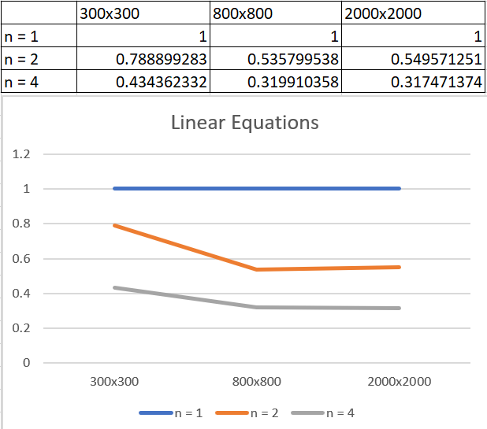

# Lab2: Решение системы линейны алгебраический уравнений итеративным методом Якоби с использованием библиотеки MPI.
### Теория
В данной работе сравнивается ускорение при вычислении решения СЛАУ в зависимости от степени распараллеливания(количества используемых процессов) программы.
Распараллеливание происходит за счет выделения части вектора x для вычисления каждому процессу, после чего результаты вычисления каждого из процессов рассылаются остальным. Таким образом, синхронизация происходит на каждой итерации цикла.
### Результаты
Результат распараллеливания сравнивается с (делиться на время работы) последовательного алгоритма. На оси X нанесены размеры матриц, на которых замерялось время работы, на оси Y - относительное время работы

Видно, что за счет распараллеливания удается достичь ускорения работы, однако из-за синхронизации время вычисления не в n раз меньше для n процессов, а больше.
### Как запустить программу
После компиляции программу можно запустить без аргументов (в этом случае матрицы генерируются случайно) либо с аргументами - двумя именами файлов, где в первом файле находится матрица параметров, а во втором - начальное значение вектора x, и необходимой точностью вычисления (всего три аргумента). Программа посчитает время вычисления вектора x с заданной точностью (или попытается за 1000 итераций) и выведет результат в файл LinearEquationsMPI.output
Для запуска с несколькими процессами понадобится утилита mpiexec . Пример запуска программы с аргументами с четыремя процессами:
`mpiexec.exe -n 4 $(TargetName).exe C:\source\repos\Conc-Prog-Labs\Inputs2\coefficientsFile2000.input C:\source\repos\Conc-Prog-Labs\Inputs2\xApproxFile2000.input 0.000001`
