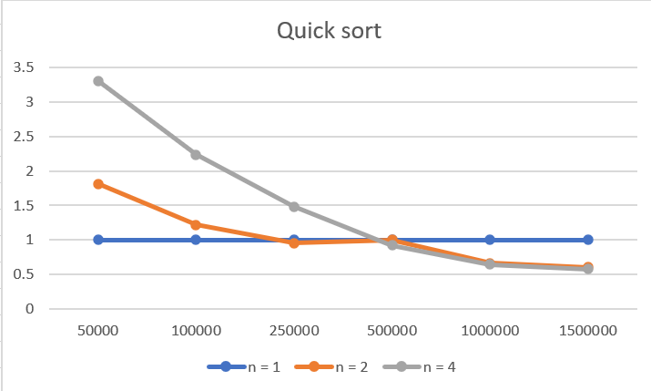

# Lab3: Реализация алгоритма параллельной быстрой сортировки с использованием библиотеки MPI.
### Теория
В данной работе сравнивается ускорение при сортировке массива в зависимости от степени распараллеливания(количества используемых процессоров) программы.
Распараллеливание происходит в два этапа: 
* На первом этапе необходимо распределить элементы массива между процессорами таким образом, чтобы у процессора с меньшим номером были только элементы с меньшим значением, а у большего - только с большим. Это достигается с помощью последовательного разбиения всех процессов на две подгруппы равной величины, при этом в первой группе все элементы меньше опорного, а во втором большего. Опорный элемент выбирается как медиана из 7 псевдослучайных элементов массива. После разбиения этот процесс продолжается уже для получившихся групп, их подгрупп, и т. д.
* На втором этапе каждый процессор выполняет последовательный quick sort над своими элементами массива. Результаты всех процессоров собираются в единый массив в порядке нумерации процессоров.
### Результаты
Результат распараллеливания сравнивается с (делиться на время работы) последовательного алгоритма. На оси X нанесены размеры массивов, на которых замерялось время работы, на оси Y - относительное время работы

Видно, что за счет распараллеливания удается достичь ускорения работы только при размерах > 500000, однако даже на таких большим массивах выигрыш относительно небольшой.
### Как запустить программу
После компиляции программу можно запустить без аргументов (в этом случае массивы генерируются случайно) либо с аргументом - именем файла, где находится массив. Программа посчитает время сортировки массива и выведет результат в файл QuickSort.output
Для запуска на нескольких процессорах понадобится утилита mpiexec . Пример запуска программы с аргументами на четырех процессорах:
`mpiexec.exe -n 4 $(TargetName).exe C:\source\repos\Conc-Prog-Labs\Inputs2\QuickSort.input`
