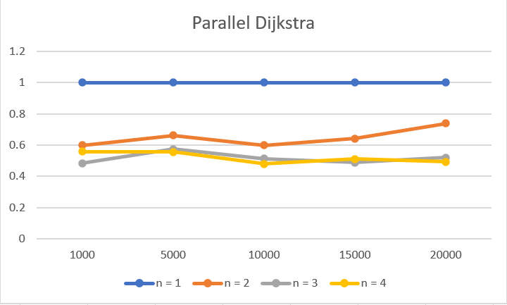

# Lab3: Реализация параллельного алгоритма Дейкстры на Java.
### Теория 
В данной работе сравнивается ускорение при вычислении расстояния от вершины графа до всех других вершин по алгоритму Дейкстры в зависимости от степени распараллеливания(количества используемых потоков) программы.
Алгоритм происходит итеративно, каждая итерация состоит из двух этапов:
* На первом этапе выбирается вершины графа. Она должна соответствовать двум условиям: она не была выбрана ранее и расстояние до этой вершины от исходной должно быть минимален среди всех вершин, которые не были выбраны ранее. вершины до которых нет пути так же не могут быть выбраны.
* На втором этапе проверяются все соседние вершины с выбранной. Для каждой соседней вершины вычисляется расстояние до нее как сумма расстояния до текущей вершины плюс вес ребра, и сравнивается с уже известным расстоянием до соседнией вершины. Если новое расстояние меньше, соседняя вершина обновляет информацию о самом коротком расстоянии до нее.
Алгоритм заканчвает работу когда не остается вершин, подходящих под условия из первого этапа.
Распараллеливание происходит на обоих этапах - работа делиться равномерно между доступными потоками, затем результат синхронизируется. На первом этапе каждый поток работает со своей частью узлов, затем среди каждой части вычисляется самый ближайший узел. На втором этапе каждый поток обрабатывает свою часть соседей.
### Результаты
Результат распараллеливания сравнивается с (делиться на время работы) последовательного алгоритма. На оси X нанесено количетство узлов графа, на которых замерялось время работы, на оси Y - относительное время работы

Видно, что за счет распараллеливания удается достичь значительного ускорения работы (достаточно близко к двум даже для двух потоков), а при количестве узлов больше 10000 наличие 3 и 4-го потоков сильно влияет на результат.
### Как запустить программу
После компиляции программу можно запустить с двумя либо тремя аргументами - именем файла, где находится матрица смежности, номером стартовой вершины, и (опционально) количество потоков. При остуствии третьего аргумента программа будет вычислять время для количества потоков от 1 до 4. Программа посчитает время поиска расстояний и выведет результат в файл ParallelDijkstra.output
Для обозначения отсутствия ребра можно использовать как отрицательные числа, так и строку "INF". В выходном файле обозначение отсутствия пути всегда строкой "INF"
